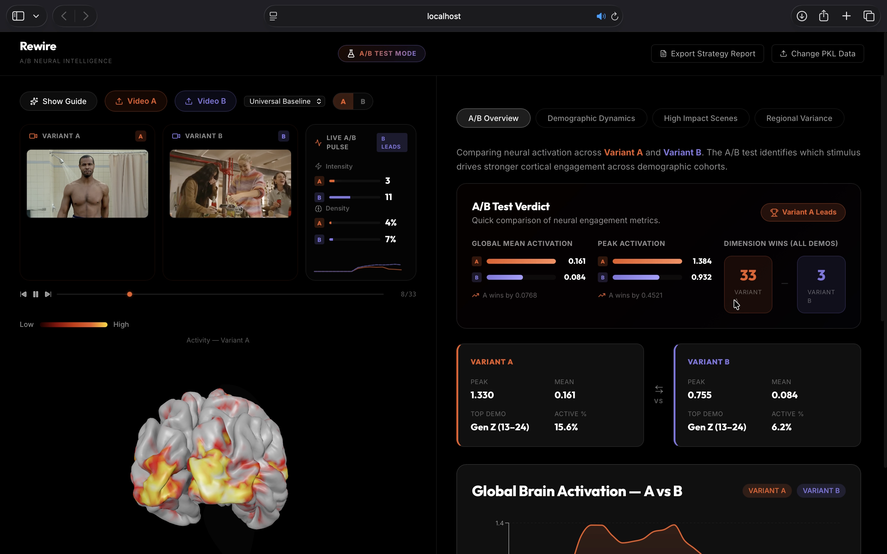
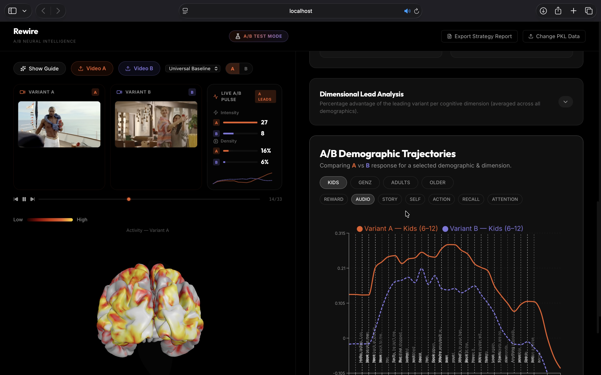
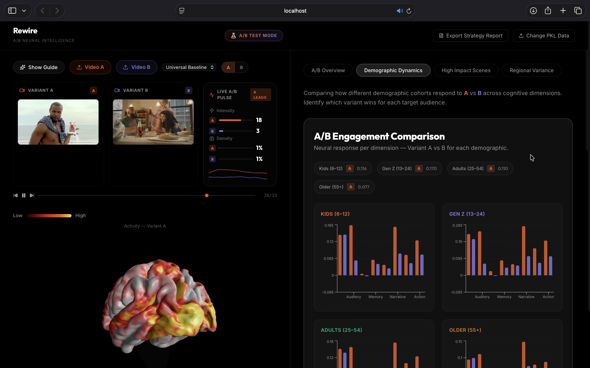
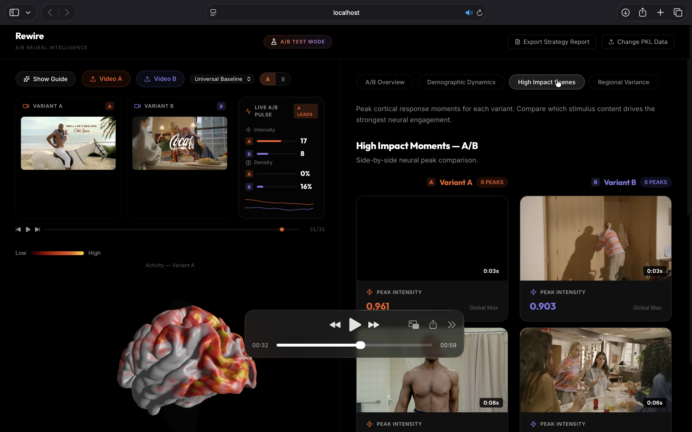
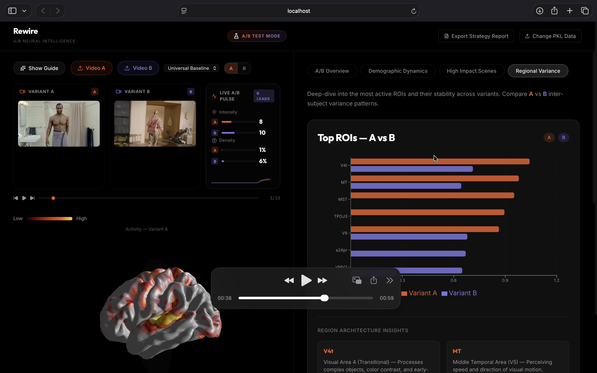
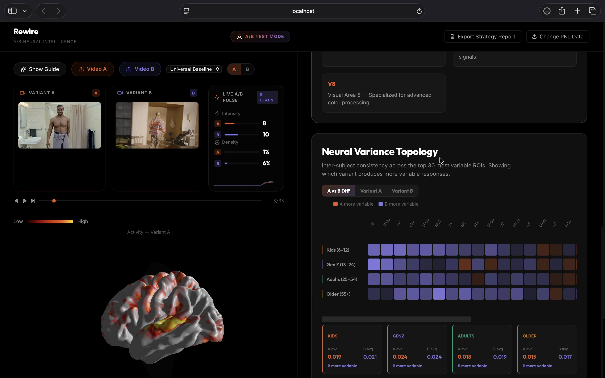
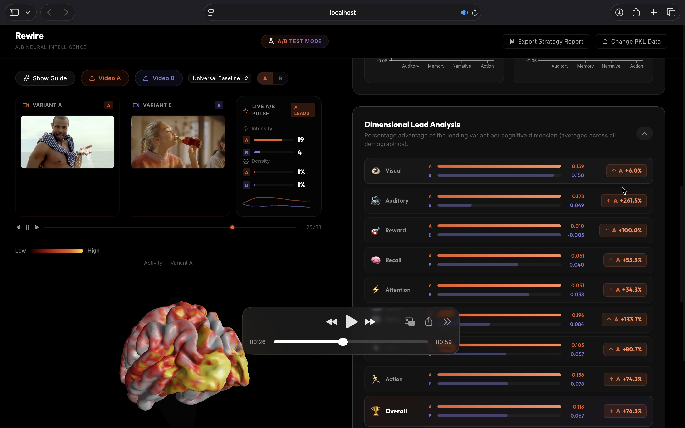

# Rewire: Neural Intelligence & Neuromarketing Analytics 🧠🚀

**Rewire** is a professional-grade neuromarketing platform that eliminates guesswork in creative A/B testing. By leveraging state-of-the-art deep learning (Meta's Tribe v2) and biologically-grounded demographic synthesis, Rewire predicts exactly how human brains respond to video content—before you spend a single rupee on ad placements.


## 📸 Platform Interface

|  |  |
|:---:|:---:|
| *A/B Test Verdict & 3D Brain* | *A/B Demographic Trajectories* |

|  |  |
|:---:|:---:|
| *A/B Engagement Comparison* | *High Impact Moments — A/B Comparison* |

|  |  |
|:---:|:---:|
| *Top Regions of Interest (ROIs)* | *Neural Variance Topology* |

|  |
|:---:|
| *Dimensional Lead Analysis* |

---

## 🌟 Key Features

- **fMRI-Grade Predictions**: Uses high-dimensional deep learning to simulate cortical activation across 20,484 vertices.
- **200-Brain Synthetic Ensemble**: Reconstructs heterogeneous audience cohorts (Kids, Gen Z, Adults, Older) with realistic neural variance.
- **3D Neuronal Mapping**: Real-time cortical activation visualization on a 3D brain mesh (using Three.js).
- **A/B Testing Engine**: Head-to-head comparison of two video variants across 9 cognitive benchmarks.
- **Automated Strategy Reports**: One-click generation of professional PDF-ready reports with peak activation timestamps and demographic wins.
- **Neural Blindspot Audit**: Identifies low-engagement "dead zones" to optimize media spend.

---

## 🏗️ Technical Architecture

Rewire operates on a sophisticated three-stage neural pipeline:

### 1. Neural Ingestion (Tribe v2 Inference)
Powered by **Meta's Tribe v2** model running on **Nvidia L4 GPUs** (via Modal). It transforms raw video/audio frames into high-resolution Z-scores of predicted cortical activity.

### 2. Demographic Synthesis (Analysis Engine V3)
Our proprietary engine (`backend/analysis.py`) applies biologically-grounded realism to raw predictions:
- **Temporal Latency**: Staggers peaks to reflect real-world processing speeds (+3s for Kids, +5s for Older).
- **AR(1) Autocorrelation**: Mimics the "Pink Noise" of real fMRI BOLD signals.
- **Network Coherence**: Uses Cholesky Decomposition to ensure functional hubs (Reward, Visual, DMN) fire as unified clusters.
- **Sigmoidal Saturation**: Applies firing caps to prevent unrealistic data spikes.

### 3. Intelligence Dashboard
A unified interface built with **React** and **FastAPI** that distills complex neural data into marketing-actionable metrics.

---

## 🛠️ Tech Stack

### Backend
- **Core**: Python 3.9+, FastAPI
- **Processing**: NumPy, SciPy, Joblib
- **Visualization (Notebooks/Dev)**: Plotly, Matplotlib, Nilearn
- **Inference**: Modal (Cloud GPU)

### Frontend
- **Framework**: React 19 (Vite)
- **3D Rendering**: React Three Fiber, Three.js
- **Charts**: Recharts
- **Icons**: Lucide-React
- **State Management**: React Hooks

---

## 🚀 Getting Started

### 1. Backend Setup
```bash
# Navigate to backend
cd backend

# Install dependencies
pip install -r requirements.txt

# Start the API server
uvicorn main:app --reload --port 8000
```

### 2. Frontend Setup
```bash
# Navigate to frontend
cd frontend

# Install dependencies
npm install

# Start the development server
npm run dev
```

### 3. Optional: Streamlit Dashboard
For deep-dive exploration of the synthesis engine:
```bash
streamlit run app.py
```

---

## 📂 Project Structure

```text
tribeRewire/
├── backend/
│   ├── main.py            # FastAPI Entry Point
│   ├── analysis.py        # Core Synthesis & Scoring Engine
│   └── requirements.txt   # Python Dependencies
├── frontend/
│   ├── src/
│   │   ├── App.jsx        # Main UI Logic
│   │   ├── components/    # Reusable UI Components
│   │   └── api.js         # API Client
│   └── package.json       # JS Dependencies
├── app.py                 # Streamlit Exploration Tool
├── modal_inference.py     # Cloud Inference Interface
└── process.md             # Detailed Technical Documentation
```

---

## 📊 User Flow

1. **Inference**: Run `modal_inference.py` to generate `.pkl` prediction files from your video assets.
2. **Upload**: Open the Rewire Dashboard and upload the `.pkl` files for Variant A and Variant B.
3. **Analyze**: Explore the **A/B Overview** to see global activation peaks and hemisphere asymmetry.
4. **Targeting**: Switch to **Demographic Dynamics** to see which variant wins for specific age groups (e.g., "Gen Z responds 15% better to Variant B in Reward evaluation").
5. **Optimize**: Use **High Impact Scenes** to identify the exact seconds that triggered the highest neural engagement.
6. **Export**: Click **Export Strategy Report** to generate a comprehensive deck for stakeholders.

---

## 🧠 Scientific Benchmarks

Engagement is calculated across 9 key cognitive dimensions:
- **Reward**: OFC, Caudate, Accumbens (The "Buy" Signal)
- **Visual Intake**: V1-V3, MT (Complexity/Attention)
- **Memory Focus**: Hippocampus, Entorhinal Cortex
- **Social Narrative**: STS, TPOJ
- **Action Readiness**: Premotor Cortex (6a, 6d)

---

## 📜 License
Internal Proprietary - Rewire Analytics Engine V3.1
© 2026 Rewire. Subconscious Intelligence. Quantified.
🚀
